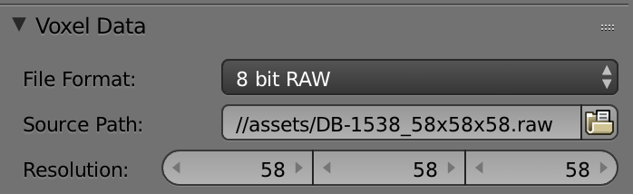

# blender-setups
Blender example setups for generating renderings from [Virtual Unfolding](https://github.com/UnlockingHistory/virtual-unfolding).

### Usage Notes

**IMPORTANT**: The newest version of Blender (`2.91.2` at the time of writing this) does not support voxel data textures in either of Eevee or Cycles rendering engines.  I rolled back to Blender `2.79` on MacOS to do these, as volumetric texture rendering will not work on a version >`2.8`.  Only [VolumetricRendering.blend](https://github.com/UnlockingHistory/blender-setups#volumetricrenderingblend) and [VolumetricRenderingFauxColoring.blend](https://github.com/UnlockingHistory/blender-setups#volumetricrenderingfauxcoloringblend) *require* volumetric textures, but so far all of these examples have only tested on Blender `2.79`.

In all these test files I've set up an [orthographic camera](https://en.wikipedia.org/wiki/Orthographic_projection) with an [isometric projection](https://en.wikipedia.org/wiki/Isometric_projection).

I render out all my animations from Blender as pngs and then create a video from that with [ffmpeg](https://ffmpeg.org/).  The files are typically output from Blender in the form XXXX.png where X is a number.  I use the following ffmpeg settings to write these sequential pngs to mp4:

```sh
ffmpeg -r 30 -i PATH_TO_FRAMES/%4d.png -c:v libx264 -preset slow -crf 22 -pix_fmt yuv420p -an OUTPUT_DIRECTORY/animation.mp4
```

- `-r 30` sets the framerate to 30 fps   
- `-i PATH_TO_FRAMES/%4d.png` specifies the input file name with 4 number in sequence.  
- `-c:v libx264 -preset slow -crf 22` encodes as h.264 with better compression settings
- `-pix_fmt yuv420p` makes it compatible with the web browser.  
- `-an` creates a video with no audio.  
- you can optionally specify `-s 640x640` to control the output size of the video.

I like using [ezgif](https://ezgif.com/video-to-gif) to convert the resulting video to an optimized gif (under the hood it is also using ffmpeg).

## VolumetricRendering.blend

This is an example file that lets you create a [volumetric rendering](https://docs.blender.org/manual/de/2.79/render/blender_render/materials/special_effects/volume.html) from CT data.  First, you will need to create a .raw file to import your data into blender.  Find more info about this using the [TOMtoRAW script](https://github.com/UnlockingHistory/virtual-unfolding/tree/main/src/visualization#tom_to_raw).


A really nice tutorial about setting up these types of renders is given in [Voxel Datacubes for 3D Visualization in Blender by Matías Gárate](https://iopscience.iop.org/article/10.1088/1538-3873/129/975/058010#paspaa4f5bs4).

When you add your own .raw file to this blender template, you'll need to tell blender the resolution of your data under Cube>Texture>Voxel Data - mine happened to be a 58x58x58 voxel cube:



Be sure to also change the dimensions of the cube to match the aspect ratio of your data.  By scaling up the size of the cube, you can increase the resolution of the resulting render.  Adjust the material's Density Scale to change the density/transparency of the volumetric data in the render.

I've already keyframed a spinning animation in the timeline, so you can try rendering an animation to see that effect.

## VolumetricRenderingFauxColoring.blend

This file is the same as above, but I've added some faux paper coloring to the voxel texture and included some extra lights and ambient occlusion to make the depth pop a bit more.  I had to use some slower settings to get this to render without nasty artifacts, so the rendering takes about 8x longer than the settings above.

